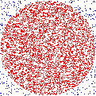

You may also wish to checkout [my github](https://github.com/bgruber).

# Compositions

I am really not much of a composer, but I have performed a few acts of musical composition, particularly of the algorithmic variety. Here are some truly horrid samples. Read the explanations first and then listen, or listen and then read the explanations, or just skip the explanations entirely. Hell, just read and skip the audio if you want. I think at this point in the gestation of my compositional abilities my ideas are often more interesting than the execution anyhow.

## φ
Written as a response to an assignment to compose around the idea of either φ (the golden ratio) or the related Fibonacci sequence. This piece represents my first attempt at sonifying the algorithm itself. This is in contrast to most algorithmic compositions which I think use the algorithm as a means to an end.

As a student of computer science, I find myself enamored of certain algorithms, particularly the recursive variety. The best way I have been able to explain it is that when I evaluate a recursive algorithm, the moment at which I hit the base case and begin to backtrack through the call stack brings a feeling I can only describe as a rose blossoming inside my head. It is one of the ways I know that I am sentient.

I know from the looks on peoples' faces when I explain this that it is not a universal feeling. The piece is the first of what I guess could be a series where my goal is to try and convey what it is that I love about an algorithm by musical means.

The major problem here is that it's not too pleasant to listen to, which I blame on the choice, or lack thereof, of synthesis technique. Lost in the infinite array of things I could do, I chickened out and used simple sine waves. Maybe someday I'll revisit this piece and change the timbre.

csound generated by perl. [(mp3)](phi.mp3) [(flac)](phi.flac)

## Flow
This piece was 2 minutes longer in its initial performance. I was never really happy with those final two minutes, which were mostly there to fulfill a class requirement for length. It was also initially performed in 5 speaker surround sound, but here I have provided a plain stereo downmix. I experimented with a mix which should emulate the surround experience with headphones, but decided that the immediacy of the sound when headphones were used diminished the experience far more than the downmix.

ProTools + Audacity. [(mp3)](flow.mp3) [(flac)](flow.flac)

## darts

 This piece is the second in the above mentioned "sonification of algorithms" series. This time we have my favorite algorithm for calculating π. Basically, you throw a dart at a square (i.e. randomly pick a point in a square), and based on the distance formula you can determine whether or not it landed on the dartboard (the circle inscribed in the square). By taking the ratio of points picked inside the circle to total number of points picked, you get an approximation of π. To calculate it exactly you, um, just pick an infinite number of points.

For a variety of reasons, this is a grossly inefficient and horribly useless method of calculating π, but I love the conceptuality of it. In sonifying the algorithm, I tried to express the limitations of a digital system in regards to the infinite precision required to deal with a concept like π.

darts was originally presented at Diapason as part of the end-of-semester concert for [Luke DuBois'](http://lukedubois.com) Algorithmic Composition class. That performance also utilized a projection showing the points of the circle as they were picked out by the algorithm, as seen in the above graphic.

rtcmix driven by Max/MSP. [(mp3)](darts.mp3) [(flac)](darts.flac)
